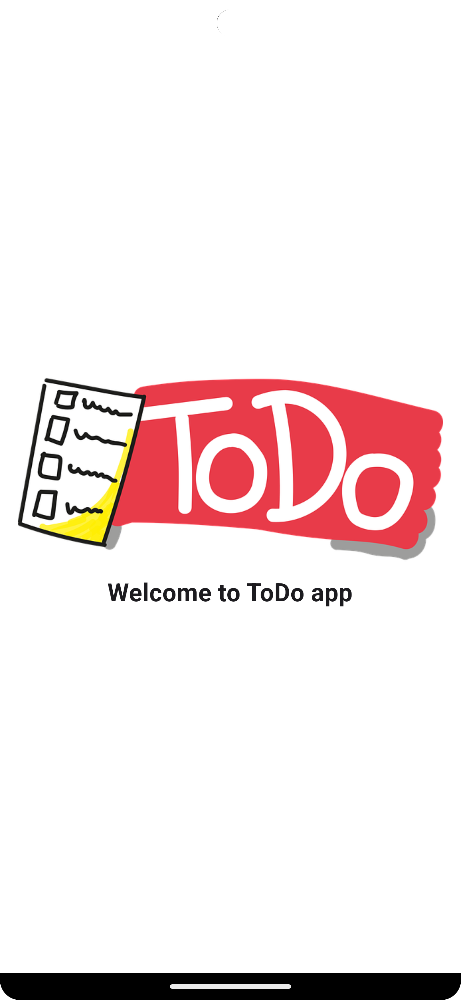
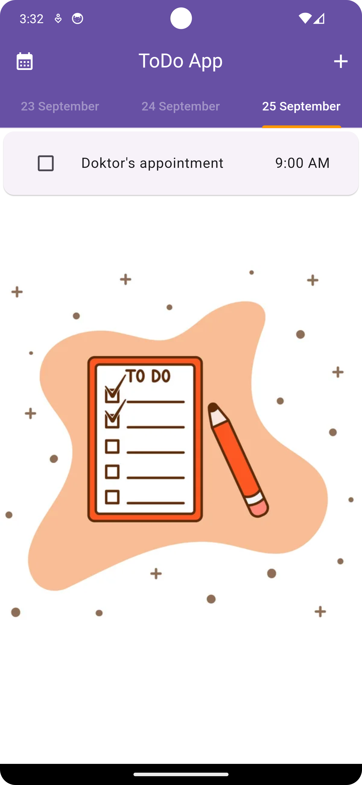
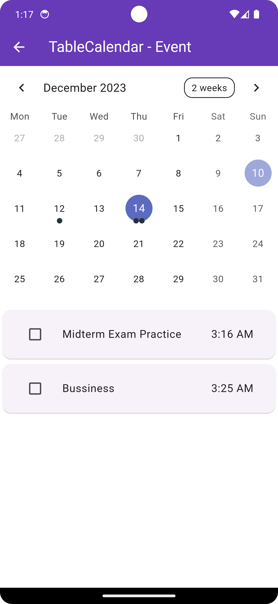
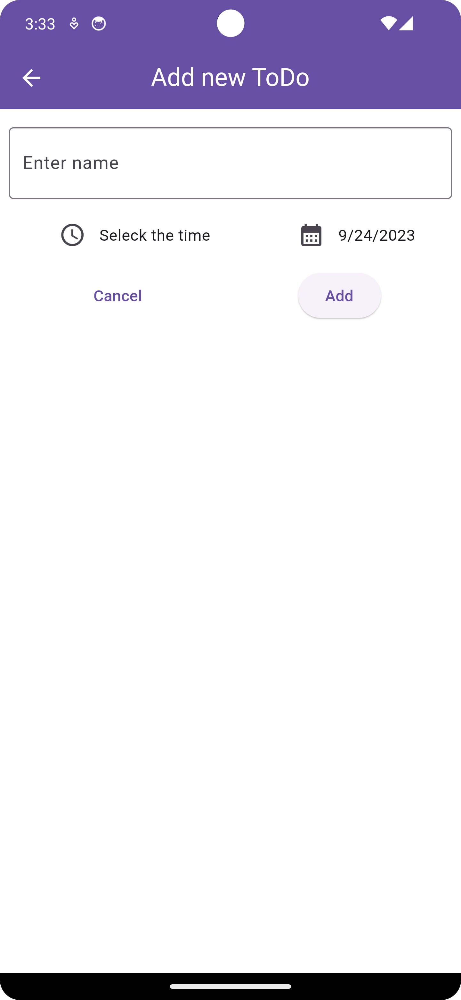

# ToDo


This project includes a sample mobile todo application developed with Flutter.

## Contents

- [About the project](#about-the-project)
- [App Images](#app-images)
- [Used Packages](#used-packages)
- [Requirements](#requirements)
- [Setup](#setup)


## About the project

This app allows users to record what to do and check if they have done it. In addition, an application screen has been designed that allows the user to see the previous and next days on the application screen. Flutter Riverpod was used in the state management part of the application. In this way, live data transfer is provided. In addition, the table calendar package allows the user to see todos in the form of a calendar.

### App Images

| Splash screen | Day | Day |
|-----------|-----------|-----------|
|  |  |  |


| Calendar | New ToDo |
|-----------|-----------|
|  |  | 


### Used Packages
- [Flutter Riverpod](https://pub.dev/packages/flutter_riverpod) <br>
   <br>
- [Table Calendar](https://pub.dev/packages/table_calendar) <br>
- [Sqflite](https://pub.dev/packages/sqflite) <br>
- [Toast Message](https://pub.dev/packages/fluttertoast) <br>
- [Intl](https://pub.dev/packages/intl) <br>


### Requirements

You need the following requirements for the application to work:

- [Flutter and Dart SDK](https://docs.flutter.dev/get-started/install)
- An IDE like [Android Studio](https://developer.android.com/studio) or [Visual Studio Code](https://code.visualstudio.com/download)
- Emulator or a physical device


You can use the following commands to check the requirements:

```
flutter doctor
```
## Setup
Steps on how to install the app in your local environment:<br>
1-Clone the repository:
```
git clone https://github.com/MehmetCopurCE/todo_app.git
```

2-Go to the application directory:
```
cd todo_app
```
3- Run the application
```
flutter run
```

<br>

You can share your opinions and suggestions about the application with me from the links below.

[](https://www.linkedin.com/in/mehmet-copur/)

